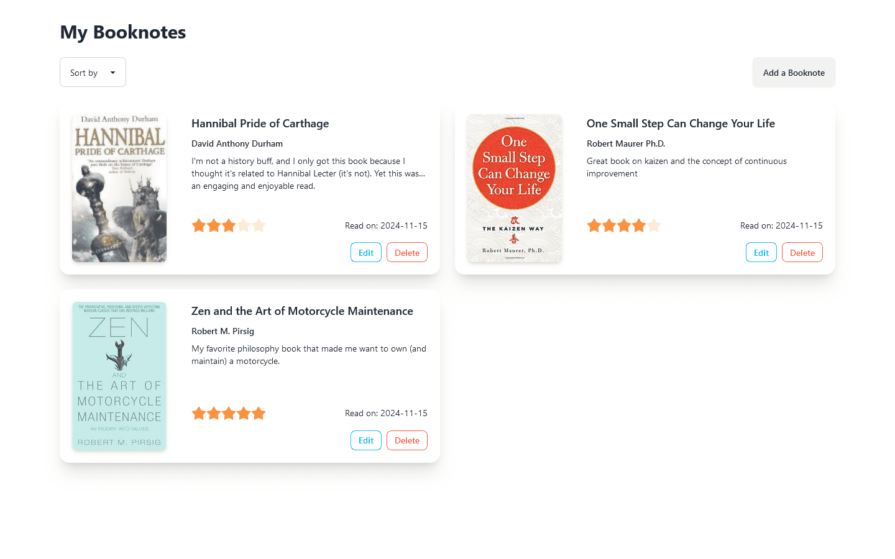
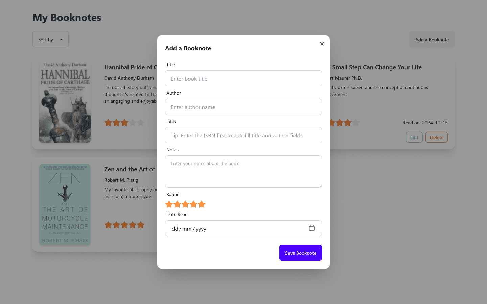

# Book Notes

A book notes app built with Node, Express, and PostgreSQL.

This is my fifth capstone project for [The Complete 2024 Web Development Bootcamp](https://betmgm.udemy.com/course/the-complete-web-development-bootcamp/) by Dr. Angela Yu on Udemy.

## Table of Contents

- [Screenshots](#screenshots)
- [Getting Started](#getting_started)
<!-- - [Usage](#usage) -->
<!-- - [Contributing](../CONTRIBUTING.md) -->

## Screenshots




## Built with

- Node.js
- esbuild
- TailwindCSS / DaisyUI
- PostgreSQL

## Getting Started

<!-- These instructions will get you a copy of the project up and running on your local machine for development and testing purposes. See [deployment](#deployment) for notes on how to deploy the project on a live system. -->

### Prerequisites

- Node.js
- PostgreSQL (or Docker)

### Development

For this project, the backend and frontend are split into separate directories. While developing, you need to run `npm install` and `npm run dev` on both folders.

**Backend**

1. Start a Postgres server on your machine if you have a native installation. You can create the tables and insert seed data by running the commands in [this file](./.docker/postgres/seed-postgres.sql).

   Otherwise, if you have Docker, you can start a Postgres container with seed data by running:

   ```sh
   docker compose --profile postgres up

   # Stop and remove containers:
   # docker compose --profile postgres down

   # Stop and remove containers AND volumes:
   # docker compose --profile postgres down -v
   ```

2. Inside the `backend` directory, create an `.env` file with the connection string of your Postgres database assigned to the `POSTGRES_URL` variable.
3. Run `npm install`, then `npm run dev`.

**Frontend**

In another terminal, cd to the `frontend` directory and run `npm install`, then `npm run dev`.

Go to http://localhost:3000 to visit the site.
